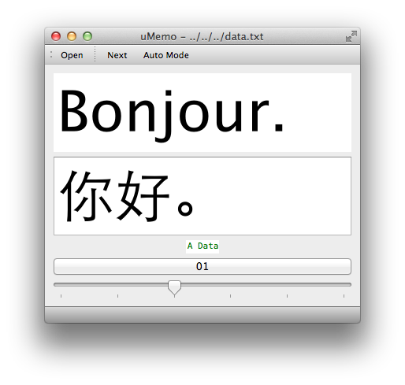



## Have a look first.

## What's it for?

For short, it's a toy for me and my children.

And I hope it will be one of yours, and I'm trying hard to make that happen.

With it, you can practice things that require repetitive short memory exercises.

## Why I create it?

The motive for me to create it is really simple: I need a tool to assist me learning Francais.

Yet, soon after I coded on it for a while, I realized that I can create a general platform and let uses fill in the contents, which can then be imported.

So when I try to teach my children how to pronounce Chinese words, it already eased the process a lot.

## What's the goals?

Here is a wish list for the project, some of which are completed already, yet some are far to reach.

I put as many as I can figure out here for reference later:

1. 
1. 
1. 
1. 
1. 
1. 
1. 
1. 
1. 
1. 

## What's current status?

There have been 3 days since starting from zero, and I have gone through 3 major milestones:

- 1st usable version: very basic manual/auto play mode features
- 1st comfortable version: give more control on index and can select files at will
- 1st ample version: can have description, image and audio attatchments
